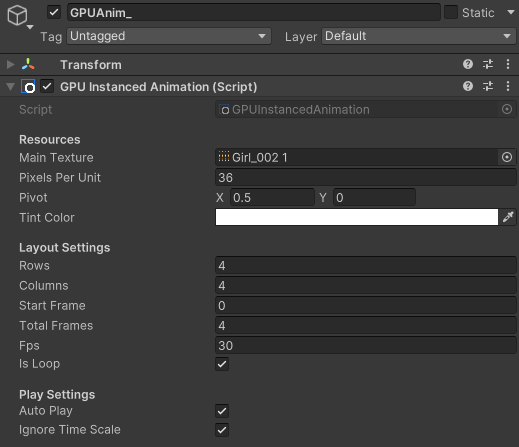

# GPU 序列帧动画系统使用手册

本系统基于 **GPU Instancing** 技术实现，支持在保持极低 Draw Call 的前提下，实现海量序列帧动画实体的独立播放与动态叠色。

[TOC]

## 1. 核心特性

**高性能合批**：即使每个实体的动画进度、缩放、颜色不同，只要使用相同贴图，即可实现 GPU Instancing 合批 。

**灵活锚点**：支持通过 `Pivot` 偏移调整渲染中心 。

**动态叠色**：支持通过 `MaterialPropertyBlock` 实时修改颜色（如受击红闪），不打断合批。

**渐变闪烁**：内置支持基于 `Gradient` 曲线的受击过渡效果。

------

## 2. 环境配置

- 下载并导入 GpuFrameAnimation.unitypackage

## 3. 快速上手

### 3.1 创建动画实体

在 Unity **Hierarchy** 面板中：

1. **右键**点击空白处或某个父物体。
2. 选择 **Create Other -> GPU Animation Entity**。
3. 系统将根据预制体模板自动生成一个新的动画对象。

### 3.2 基础参数设置

<div style="text-align: left;">    </div>

在 `GPUInstancedAnimation` 组件面板中设置：

- **Main Texture**：设置序列帧图集 。

- **Pixels Per Unit**：PPU3

- **Pivot**：调整中心点（0.5, 0.5 为中心，0.5, 0 为底部中心）。

- **Tink Color**： 叠色

- **Rows / Columns**：根据图集布局设置行数和列数 。

- **Start Frame:** 起始索引

- **Total Frames**：动画总帧数 。

- **FPS**：动画播放速度 。

- **Auto Play:**  OnEnable时自动播放

- **Ignore Time Scale:** 是否忽略时间

  

## 4. 进阶功能：受击闪烁 (Flash)

若要实现受击时的渐变变色效果，需配合 `GPUAnimFlash` 扩展脚本。

### 4.1 配置步骤

1. 在预制体或场景物体上挂载 `GPUAnimFlash` 脚本。
2. 在 **Flash Gradient** 中设置颜色曲线：
   - **0% 处**：设置受击颜色（如纯白色或亮红色）。
   - **100% 处**：**必须**设置为纯白色（RGBA: 1, 1, 1, 1），以恢复贴图原色。
3. 设置 **Default Duration**（默认持续时间）。

### 4.2 代码调用

在战斗逻辑脚本中，通过以下方式触发：

C#

```
// 基础闪烁
GetComponent<GPUAnimFlash>().PlayFlash();

// 自定义持续时间闪烁
GetComponent<GPUAnimFlash>().PlayFlash(0.15f);
```

------

## 5. 开发 API 接口

### 5.1 颜色控制

C#

```
// 动态改变实体叠色（不打断合批）
public void SetTintColor(Color color);
```

### 5.2 播放控制

C#

```
// 重新开始播放动画
public void Play(); 

// 切换动画图集
public void ChangeAnimationCategory(Material newCategoryMat);
```

### 5.3 事件监听

C#

```
// 动画开始时触发
OnPlayStart;

// 动画播放结束时触发（非循环模式下）
OnPlayFinished;
```
